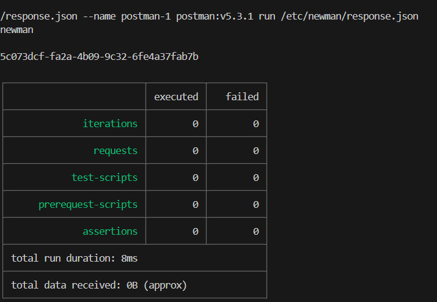

### This is a documentation for the attached task:
[Docker-task](../Devops_tasks(cy).pdf)

## Steps
1- Create a Dockerfile

```Dockerfile
FROM postman/newman:5.3-alpine
RUN apk update && apk upgrade && \
    npm install -g newman-reporter-csvallinone && \
    apk add curl zip ping && \
    echo "nameserver 8.8.8.8" >> /etc/resolv.conf && \
    echo "nameserver 1.1.1.1" >> /etc/resolv.conf && \
    rm -rf /var/cache/apk/* 
ENV NODE_PATH=/usr/local/lib/node_modulesvalue 
WORKDIR  /etc/newman
ENTRYPOINT ["newman"] 
```

2- During building an image, I faced an Error-1

### Error-1
```
/bin/sh: can't create /etc/resolv.conf: Read-only file system
```

### Sol-1 
- Create [resolve.conf](resolv.conf), then copy it.


### Error-2
```
ERROR: unable to select packages:
ping (no such package):
```

### Sol-2
- The `ping` package is not available in the Alpine Package Manager (apk). In Alpine Linux, the ping utility is provided by the `iputils`package
```Dockerfile
apk add curl zip iputils 
```

3- Create a docker image 
```bash
docker build -t postman:v5.3.1 .
```

4- Create a [response.json](response.json)
```
# GET content of this URL
https://jsonplaceholder.typicode.com/posts
```

5- Run a container
```bash
docker run --rm -it -v ./response.json:/etc/newman/response.json --name postman-1 postman:v5.3.1 run /etc/newman/response.json
```


